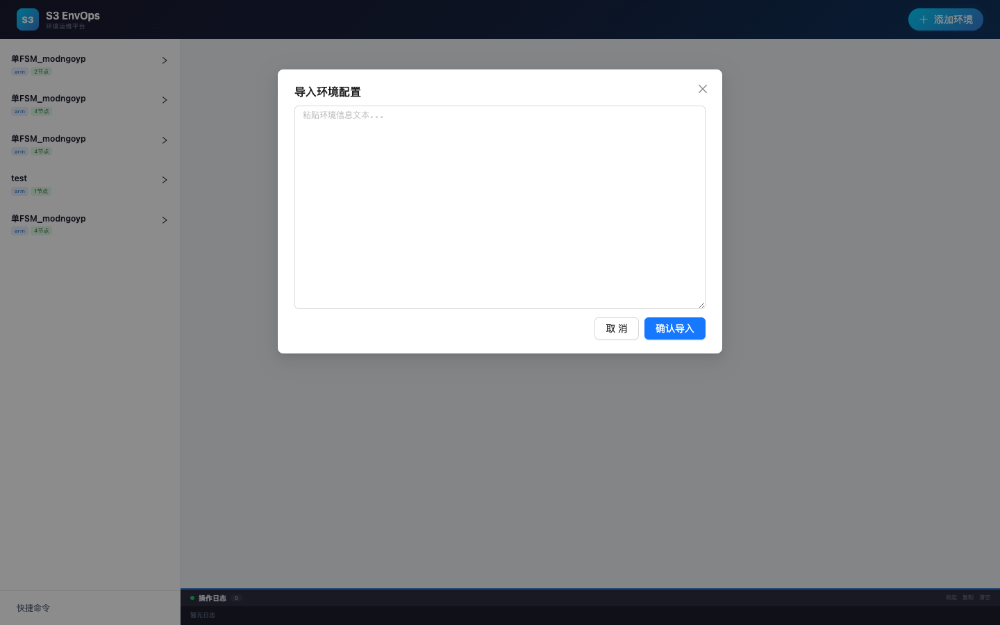
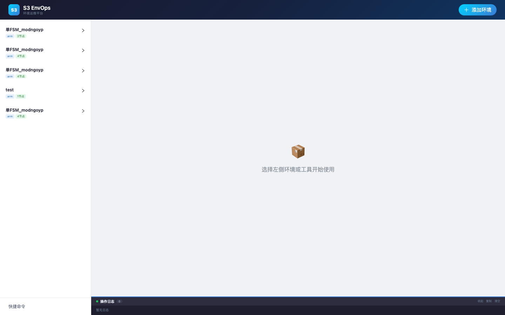
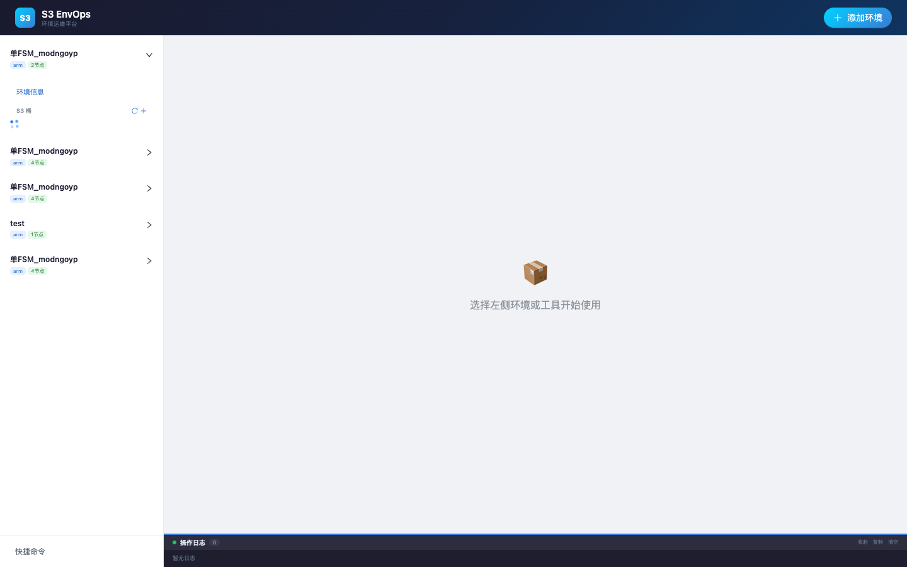

# S3 EnvOps — S3 环境运维平台

Web 端 S3 存储环境运维管理平台，支持一键解析环境信息文本、多环境管理、S3 存储运维操作、节点 Xshell 连接、快捷命令管理和操作日志。

## 需求描述

### 1. 环境信息一键解析

支持粘贴标准格式的环境信息文本，自动解析并结构化展示：

- 环境名称、CPU 架构、型号、形态、磁盘信息
- 管理界面（按钮跳转）
- 节点信息（名称、内网 IP、外网 IP、登录凭证）
- S3 配置（Endpoint、AK、SK）

支持多次添加环境，每个环境的信息独立展示。

**输入格式示例：**

```
--------单FSM_modngoyp环境信息--------

    环境名称:单FSM_modngoyp
    环境ID:163e00f3-90eb-42cc-9f6f-a427785cafe1
    实例ID:54cf5e23-9e8d-4453-8134-413841f06813
    型号:pacific
    CPU架构:arm
    形态:虚机
    盘:SATA_SSD: 960GB
    管理界面:https://7.197.106.190:8088
    账号:admin
    密码:Admi
    SDE Name:SIMUSERVICE_prod_g00471473_163e00f3-90eb-42cc-9f6f-a427785cafe1
    节点:
      FSM 192.168.22.45 7.197.106.000 root/Emulat
      FSA_0 192.168.13.8 7.241.133.00 root/Emulati
      FSA_1 192.168.27.244 7.242.242.00 root/Emulat
      CLIENT 192.168.24.164 7.236.202.00 root/Emul

    S3配置:
      Endpoint: http://7.243.69.151:5080
      AK: 7D440DC8B4040A6D2B65
      SK: dEOYg8t8srGoHebDtclhSzCp
```

### 2. 节点 Xshell 连接

每个节点卡片提供 Xshell 连接按钮，通过 `ssh://` 协议唤起本地 Xshell 客户端，自动填入节点 IP 和凭证。

### 3. S3 存储运维

基于环境的 S3 配置，通过 S3 SDK 直接操作对应存储服务：

- **桶管理**：创建桶、列举桶、删除桶
- **对象管理**：列举对象、上传对象、下载对象、删除对象
- **上传模式**：支持普通上传和多段上传（Multipart Upload），分段大小可选 5/8/16/32 MB
- **下载**：优先使用浏览器文件选择器指定保存路径，不支持时回退标准下载

### 4. 快捷命令管理

独立于环境信息之外，支持配置常用运维命令模板，可使用变量：

| 变量 | 含义 |
|------|------|
| `{internalIp}` | 节点内网 IP |
| `{externalIp}` | 节点外网 IP |
| `{credentials}` | 节点登录凭证 |
| `{nodeName}` | 节点名称 |

### 5. 操作日志

界面底部固定日志面板，记录所有操作的执行状态和结果。

## 设计文档

详细设计文档和实现计划：

- [设计文档](docs/superpowers/specs/2026-04-29-s3-envops-design.md)
- [实现计划](docs/superpowers/plans/2026-04-29-s3-envops-plan.md)

## 技术栈

| 层级 | 技术 |
|------|------|
| 前端 | React 18 + Vite + Ant Design 5 |
| 后端 | Node.js + Express 4 (ESM) |
| S3 SDK | AWS SDK v3 (@aws-sdk/client-s3) |
| 数据存储 | JSON 文件 (`data/environments.json`, `data/commands.json`) |

## 快速开始

### 环境要求

- Node.js >= 18
- npm >= 9

### 安装与启动

```bash
# 克隆项目
git clone https://github.com/gengyuanzhe/s3_env_management.git
cd s3_env_management

# 安装依赖
npm install

# 开发模式（同时启动前后端）
npm run dev
```

启动后访问 http://localhost:5173，后端 API 运行在 http://localhost:34567。

### 生产模式

```bash
# 构建前端
npm run build

# 启动服务端（自动托管前端静态文件）
cd server
node src/index.js
```

访问 http://localhost:34567。

### 端口配置

- **后端端口**：修改 `server/src/index.js` 中的 `PORT` 常量
- **前端开发端口 & API 代理**：修改 `client/vite.config.js` 中的 `server.port` 和 `proxy` 配置

## 使用方法

### 添加环境

点击左侧「添加环境」按钮，粘贴环境信息文本，点击解析即可自动提取并保存。



### 查看环境详情

在左侧列表选择环境，右侧展示完整环境信息，包括基本信息标签、节点卡片和 S3 配置。



### 编辑环境

在环境详情页点击「编辑」按钮，可修改所有环境字段，包括动态增删节点。


### S3 存储操作

在左侧列表展开环境，显示该环境的桶列表。点击桶名，右侧展示桶内对象，支持上传、下载、删除操作。



### 快捷命令

切换到「快捷命令」页面，可添加、编辑、删除命令模板，支持一键复制。


## 项目结构

```
client/                 # React 前端
  src/
    components/         # UI 组件 (Layout, Sidebar, TopNav, LogPanel, 视图组件)
    components/modals/  # 6 个弹窗 (AddEnv, EditEnv, Upload, Download, CreateBucket, EditCommand)
    context/            # React Context 全局状态 (AppContext, logReducer)
    services/           # API 调用层 (api.js)
    utils/              # 工具函数 (format.js)
server/                 # Express 后端
  src/
    routes/             # API 路由 (environments, commands, s3)
    services/           # 业务逻辑 (parser, storage, s3Client)
data/                   # JSON 数据存储 (gitignored)
```
